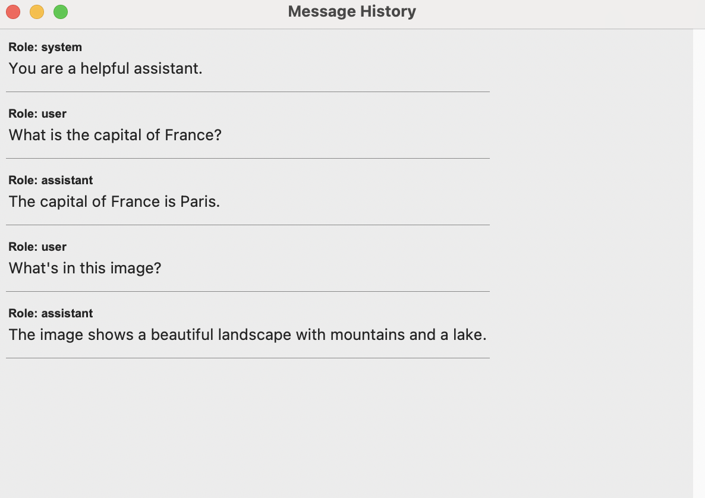
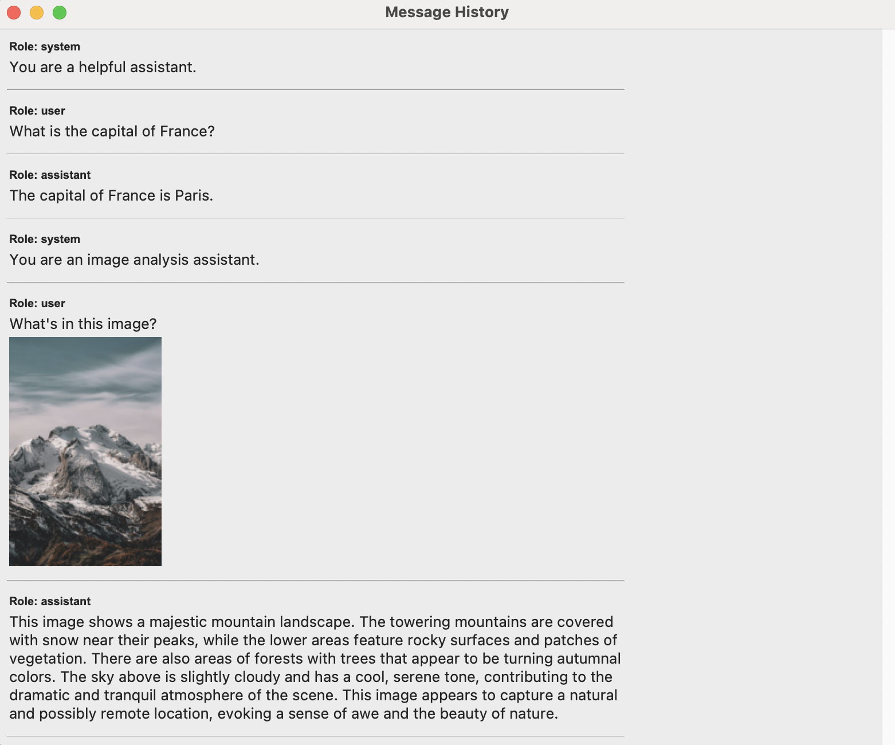

# llm-context-visualizer
Visualizes message history or context of LLMs to provide more observability during inference. It is especially useful for debugging and understanding multimodal contexts.

## Installation

Make sure you have Python 3.8 or later installed and create a virtual environment.

```
python -m venv msg_viz
source msg_viz/bin/activate
```

Install the dependencies.

```
pip install -r requirements.txt
```

## Usage

Example of message history visualization with dummy message list.
```
python message_visualizer.py
```



Example of message history visualization with OpenAI API.
```
python openai_test.py
```



